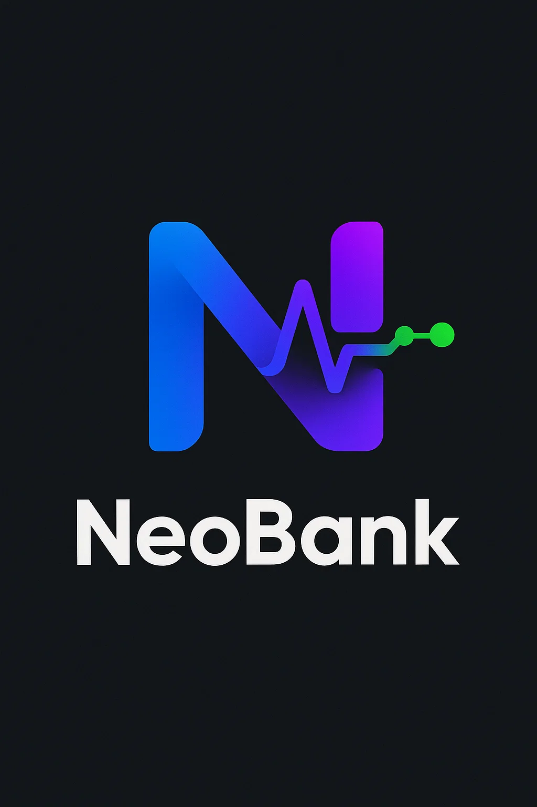

 # NeoBank - Modern Banking System



A Python-based online banking system built with Streamlit and SQLite, implementing Object-Oriented Programming principles.

## Features

- 🏦 **Account Management**
  - Create different account types (Standard, Interest Reward, Savings)
  - Deposit, withdraw, and transfer funds
  - View transaction history

- 💎 **Premium Membership**
  - Upgrade for additional benefits
  - Higher interest rates
  - No transaction fees

- 🤝 **Partner Offers**
  - Exclusive discounts and cashback
  - Integrated promotional system

- 🔒 **Secure Authentication**
  - Password hashing with SHA-256
  - Session management

## Technologies Used

- Python 3
- Streamlit (Frontend)
- SQLite (Database)
- PIL (Logo handling)

  
- JSON (Account data storage)

## Installation

1. Clone the repository:
   ```bash
   git clone https://github.com/yourusername/neobank.git
   cd neobank

## Database Schema
The system uses SQLite with the following tables:

* users - Stores user credentials and personal information

* accounts - Tracks all bank accounts

* premium_members - Manages premium subscriptions

* transactions - Records all financial transactions

* partner_usage - Tracks partner offer redemptions

  ## Project Structure

> neobank/
│── oop_project2.py          # Main application file
│── Bank_account.py          # Banking operations and account classes
│── NBank.png               # Application logo
│── requirements.txt        # Dependency list
│── README.md              # This file

## Usage
* Registration & Login

1- Create a new account with username, password, and personal details

2- Log in to access your banking dashboard

* Account Operations

1- Create multiple accounts of different types

2- Perform deposits, withdrawals, and transfers

3- View your transaction history

* Premium Features

1- Upgrade to premium for enhanced benefits

2- Access exclusive partner offers
